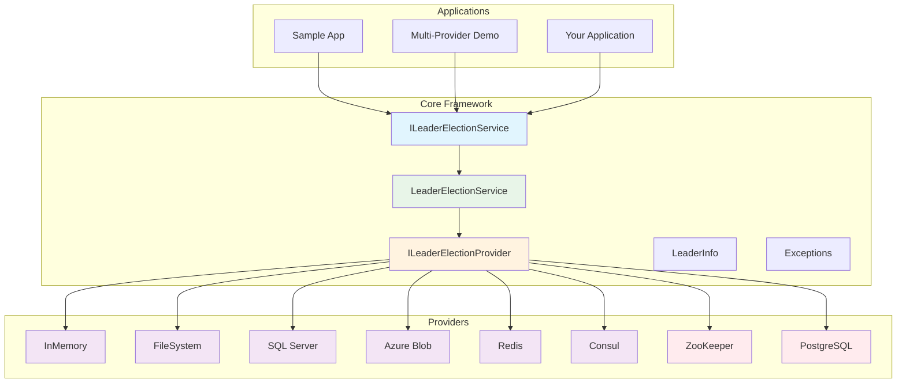

# LeaderElection.Net

A comprehensive .NET framework for implementing the Leader Election pattern with support for multiple providers including Azure Blob Storage, SQL Server, Redis, File System, In-Memory, Consul, and ZooKeeper.

## Architecture Overview



## Features

- **Multiple Providers**: Support for various storage backends
- **Distributed Mutex**: First-to-acquire becomes leader strategy
- **Heartbeat Monitoring**: Automatic leader health monitoring and failover
- **Resilient Design**: Handles transient and persistent failures gracefully
- **Thread-Safe**: All operations are thread-safe
- **Configurable**: Extensive configuration options for timeouts, retry policies, etc.
- **Dependency Injection**: Full support for .NET dependency injection
- **Comprehensive Logging**: Built-in logging and telemetry support

## Supported Providers

| Provider | Package | Description |
|----------|---------|-------------|
| Azure Blob Storage | `LeaderElection.Net.AzureBlobStorage` | Uses Azure Blob Storage for coordination |
| SQL Server | `LeaderElection.Net.SqlServer` | Uses SQL Server database for coordination |
| PostgreSQL | `LeaderElection.Net.PostgreSQL` | Uses PostgreSQL database for coordination |
| Redis | `LeaderElection.Net.Redis` | Uses Redis for coordination |
| File System | `LeaderElection.Net.FileSystem` | Uses local file system (single machine) |
| In-Memory | `LeaderElection.Net.InMemory` | In-memory provider for testing |
| Consul | `LeaderElection.Net.Consul` | Uses HashiCorp Consul for coordination |
| ZooKeeper | `LeaderElection.Net.ZooKeeper` | Uses Apache ZooKeeper for coordination |

## Quick Start

### 1. Install the Core Package

```bash
dotnet add package LeaderElection.Net
```

### 2. Install a Provider Package

```bash
# For SQL Server
dotnet add package LeaderElection.Net.SqlServer

# For Redis
dotnet add package LeaderElection.Net.Redis

# For In-Memory (testing)
dotnet add package LeaderElection.Net.InMemory
```

### 3. Configure Services

```csharp
using LeaderElection.Net;
using LeaderElection.Net.InMemory;

var builder = WebApplication.CreateBuilder(args);

// Add leader election with In-Memory provider
builder.Services.AddLeaderElection<InMemoryLeaderElectionProvider>(options =>
{
    options.ElectionGroup = "my-service";
    options.HeartbeatInterval = TimeSpan.FromSeconds(30);
    options.HeartbeatTimeout = TimeSpan.FromSeconds(90);
});

var app = builder.Build();
```

### 4. Use in Your Service

```csharp
public class MyBackgroundService : BackgroundService
{
    private readonly ILeaderElectionService _leaderElection;
    private readonly ILogger<MyBackgroundService> _logger;

    public MyBackgroundService(
        ILeaderElectionService leaderElection,
        ILogger<MyBackgroundService> logger)
    {
        _leaderElection = leaderElection;
        _logger = logger;
    }

    protected override async Task ExecuteAsync(CancellationToken stoppingToken)
    {
        // Start listening to leadership changes using AsyncEnumerable
        var leadershipTask = Task.Run(async () =>
        {
            await foreach (var change in _leaderElection.GetLeadershipChangesAsync(stoppingToken))
            {
                if (change.BecameLeader)
                {
                    _logger.LogInformation("🎉 Leadership acquired!");
                }
                else if (change.LostLeadership)
                {
                    _logger.LogWarning("😞 Leadership lost!");
                }
            }
        }, stoppingToken);

        while (!stoppingToken.IsCancellationRequested)
        {
            if (_leaderElection.IsLeader)
            {
                // Perform leader-only work
                _logger.LogInformation("🏆 Performing leader work...");
                await DoLeaderWork(stoppingToken);
            }
            else
            {
                // Perform follower work or wait
                _logger.LogInformation("👥 Waiting as follower...");
                await Task.Delay(TimeSpan.FromSeconds(10), stoppingToken);
            }
        }

        // Wait for leadership monitoring to complete
        try
        {
            await leadershipTask;
        }
        catch (OperationCanceledException)
        {
            // Expected when stopping
        }
    }

    private async Task DoLeaderWork(CancellationToken cancellationToken)
    {
        // Your leader-specific logic here
        await Task.Delay(TimeSpan.FromSeconds(5), cancellationToken);
    }
}
```

## AsyncEnumerable API

The leader election service provides a modern AsyncEnumerable API for consuming leadership change events:

### Basic Usage

```csharp
// Subscribe to all leadership changes
await foreach (var change in leaderElection.GetLeadershipChangesAsync(cancellationToken))
{
    if (change.BecameLeader)
    {
        Console.WriteLine("I am now the leader!");
    }
    else if (change.LostLeadership)
    {
        Console.WriteLine("I lost leadership!");
    }
}
```

### Filtering Events

```csharp
// Only receive leadership acquired events
await foreach (var change in leaderElection.GetLeadershipChangesAsync(
    LeadershipEventType.Acquired, cancellationToken))
{
    Console.WriteLine("Leadership acquired!");
}

// Receive both acquired and lost events
await foreach (var change in leaderElection.GetLeadershipChangesAsync(
    LeadershipEventType.Acquired | LeadershipEventType.Lost, cancellationToken))
{
    // Handle events
}
```

### Extension Methods

The framework provides powerful LINQ-style extension methods:

```csharp
// Take only the first leadership acquisition
await foreach (var change in leaderElection.GetLeadershipChangesAsync(cancellationToken)
    .TakeUntilLeader(cancellationToken))
{
    Console.WriteLine("Waiting for leadership...");
}

// Process events while we are the leader
await foreach (var change in leaderElection.GetLeadershipChangesAsync(cancellationToken)
    .WhileLeader(cancellationToken))
{
    Console.WriteLine("Still the leader!");
}

// Execute callbacks on leadership transitions
await leaderElection.GetLeadershipChangesAsync(cancellationToken)
    .OnLeadershipTransition(
        onAcquired: e => Console.WriteLine("Acquired!"),
        onLost: e => Console.WriteLine("Lost!"),
        cancellationToken);

// Combine multiple extension methods
await foreach (var change in leaderElection.GetLeadershipChangesAsync(cancellationToken)
    .Where(e => e.BecameLeader || e.LostLeadership, cancellationToken)
    .DistinctUntilChanged(cancellationToken)
    .Take(5, cancellationToken))
{
    // Process filtered events
}
```

## Provider-Specific Configuration

### SQL Server Provider

```csharp
builder.Services.AddSqlServerLeaderElection(
    connectionString: "Server=localhost;Database=MyApp;Trusted_Connection=true;",
    options =>
    {
        options.ElectionGroup = "my-service";
        options.HeartbeatInterval = TimeSpan.FromSeconds(30);
        options.HeartbeatTimeout = TimeSpan.FromSeconds(90);
    });
```

### PostgreSQL Provider

```csharp
builder.Services.AddPostgreSQLLeaderElection(
    connectionString: "Host=localhost;Database=MyApp;Username=user;Password=password;",
    options =>
    {
        options.ElectionGroup = "my-service";
        options.HeartbeatInterval = TimeSpan.FromSeconds(30);
        options.HeartbeatTimeout = TimeSpan.FromSeconds(90);
    });
```

### Redis Provider

```csharp
builder.Services.AddRedisLeaderElection(
    connectionString: "localhost:6379",
    options =>
    {
        options.ElectionGroup = "my-service";
        options.HeartbeatInterval = TimeSpan.FromSeconds(30);
        options.HeartbeatTimeout = TimeSpan.FromSeconds(90);
    });
```

### Azure Blob Storage Provider

```csharp
builder.Services.AddAzureBlobStorageLeaderElection(
    connectionString: "DefaultEndpointsProtocol=https;AccountName=...",
    options =>
    {
        options.ElectionGroup = "my-service";
        options.HeartbeatInterval = TimeSpan.FromSeconds(30);
        options.HeartbeatTimeout = TimeSpan.FromSeconds(90);
    });
```

### Consul Provider

```csharp
builder.Services.AddConsulLeaderElection(
    address: "http://localhost:8500",
    options =>
    {
        options.ElectionGroup = "my-service";
        options.HeartbeatInterval = TimeSpan.FromSeconds(30);
        options.HeartbeatTimeout = TimeSpan.FromSeconds(90);
    });
```

### ZooKeeper Provider

```csharp
builder.Services.AddZooKeeperLeaderElection(
    connectionString: "localhost:2181",
    options =>
    {
        options.ElectionGroup = "my-service";
        options.HeartbeatInterval = TimeSpan.FromSeconds(30);
        options.HeartbeatTimeout = TimeSpan.FromSeconds(90);
    });
```

#### Advanced Configuration Examples

**PostgreSQL with Custom Schema and Table:**
```csharp
builder.Services.AddPostgreSQLLeaderElection(options =>
{
    options.ConnectionString = "Host=localhost;Database=myapp;Username=user;Password=pass";
    options.TableName = "custom_leader_election";
    options.SchemaName = "leader_election";
    options.AutoCreateTable = true;
    options.CommandTimeoutSeconds = 60;
}, leaderElectionOptions =>
{
    leaderElectionOptions.ElectionGroup = "my-service";
    leaderElectionOptions.ParticipantId = Environment.MachineName;
    leaderElectionOptions.HeartbeatInterval = TimeSpan.FromSeconds(15);
    leaderElectionOptions.HeartbeatTimeout = TimeSpan.FromSeconds(45);
    leaderElectionOptions.EnableDetailedLogging = true;
});
```

**ZooKeeper with Custom Session Settings:**
```csharp
builder.Services.AddZooKeeperLeaderElection(options =>
{
    options.ConnectionString = "zk1:2181,zk2:2181,zk3:2181";
    options.RootPath = "/my-app/leader-election";
    options.SessionTimeout = TimeSpan.FromSeconds(30);
    options.ConnectionTimeout = TimeSpan.FromSeconds(10);
    options.MaxRetries = 5;
    options.RetryDelay = TimeSpan.FromSeconds(2);
    options.AutoCreateRootPath = true;
}, leaderElectionOptions =>
{
    leaderElectionOptions.ElectionGroup = "my-service";
    leaderElectionOptions.ParticipantId = $"{Environment.MachineName}-{Environment.ProcessId}";
    leaderElectionOptions.HeartbeatInterval = TimeSpan.FromSeconds(10);
    leaderElectionOptions.HeartbeatTimeout = TimeSpan.FromSeconds(30);
});
```

## Key Concepts

### Leader Election Process

1. **Election**: Multiple instances compete to become the leader
2. **Leadership**: One instance becomes the leader and performs exclusive work
3. **Heartbeat**: The leader sends periodic heartbeats to maintain leadership
4. **Failover**: If the leader fails, a new election occurs automatically

### Leadership Change Events

The service provides an AsyncEnumerable API for observing leadership changes:

- **Acquired**: Emitted when the current instance becomes the leader
- **Lost**: Emitted when the current instance loses leadership
- **Changed**: Emitted on any leadership status change (including when another participant becomes leader)

Use `GetLeadershipChangesAsync()` to subscribe to these events and optionally filter by event type using `LeadershipEventType` flags.

### Configuration Options

- **ElectionGroup**: Logical group name for the election (multiple services can have different groups)
- **ParticipantId**: Unique identifier for this instance (auto-generated if not specified)
- **HeartbeatInterval**: How often the leader sends heartbeats
- **HeartbeatTimeout**: How long to wait before considering a leader dead
- **ElectionInterval**: How often followers attempt to become leader
- **LockTimeout**: Maximum time to hold a lock during election
- **AutoStart**: Whether to automatically start the election process

## Testing

The framework includes comprehensive test coverage:

```bash
# Run all tests
dotnet test

# Run specific test project
dotnet test tests/LeaderElection.Net.Tests/
dotnet test tests/LeaderElection.Net.IntegrationTests/
```

## Samples

Check out the sample applications:

- **Basic Sample**: `samples/LeaderElection.Sample/` - Single provider demonstration
- **Multi-Provider Demo**: `samples/LeaderElection.MultiProvider/` - Multiple instances competing

```bash
# Run the basic sample with different providers
cd samples/LeaderElection.Sample
dotnet run inmemory
dotnet run filesystem
dotnet run sqlserver "Server=localhost;Database=Test;Trusted_Connection=true;"
dotnet run postgresql "Host=localhost;Database=leaderelection;Username=user;Password=pass"
dotnet run redis "localhost:6379"
dotnet run consul "http://localhost:8500"
dotnet run zookeeper "localhost:2181"

# Run the multi-provider demo
cd samples/LeaderElection.MultiProvider
dotnet run
```

## Testing

The project includes comprehensive unit tests and integration tests. Integration tests use Docker containers to test against real services.

```bash
# Run unit tests
dotnet test tests/LeaderElection.Net.Tests/

# Run integration tests (requires Docker)
docker-compose up -d
dotnet test tests/LeaderElection.Net.IntegrationTests/
docker-compose down
```

### Testing with Docker Compose

The included `docker-compose.yml` file provides all the necessary services for testing:

- **PostgreSQL** (port 5432) - For PostgreSQL provider testing
- **ZooKeeper** (port 2181) - For ZooKeeper provider testing
- **Redis** (port 6379) - For Redis provider testing
- **Consul** (port 8500) - For Consul provider testing
- **Azurite** (ports 10000-10002) - For Azure Blob Storage provider testing
- **SQL Server** (port 1433) - For SQL Server provider testing

```bash
# Start all services
docker-compose up -d

# Check service health
docker-compose ps

# View logs for a specific service
docker-compose logs postgres
docker-compose logs zookeeper

# Stop all services
docker-compose down

# Stop and remove volumes (clean slate)
docker-compose down -v
```

## Docker Support

The framework works seamlessly in containerized environments. See `docker-compose.yml` for examples of running with various backing services.

## Contributing

Contributions are welcome! Please see our contributing guidelines and code of conduct.

## License

This project is licensed under the MIT License - see the LICENSE file for details.
```
